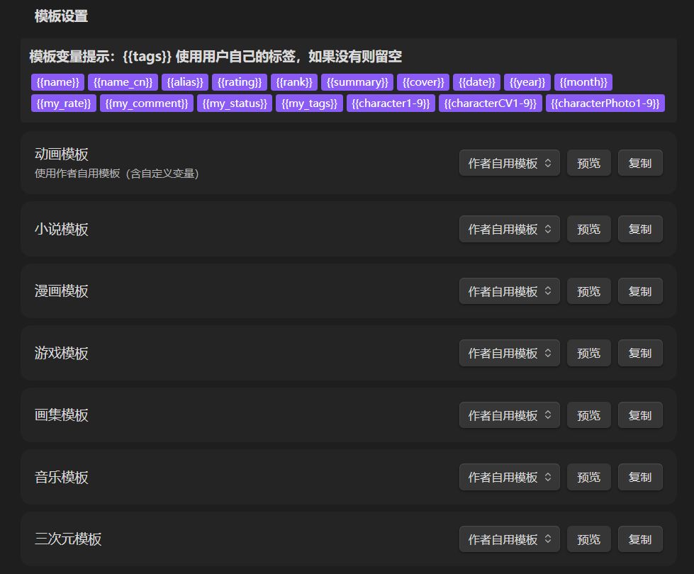
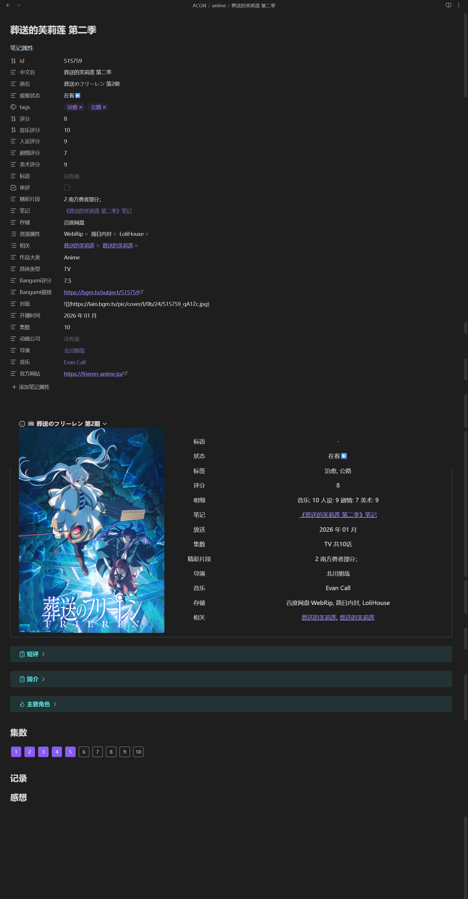
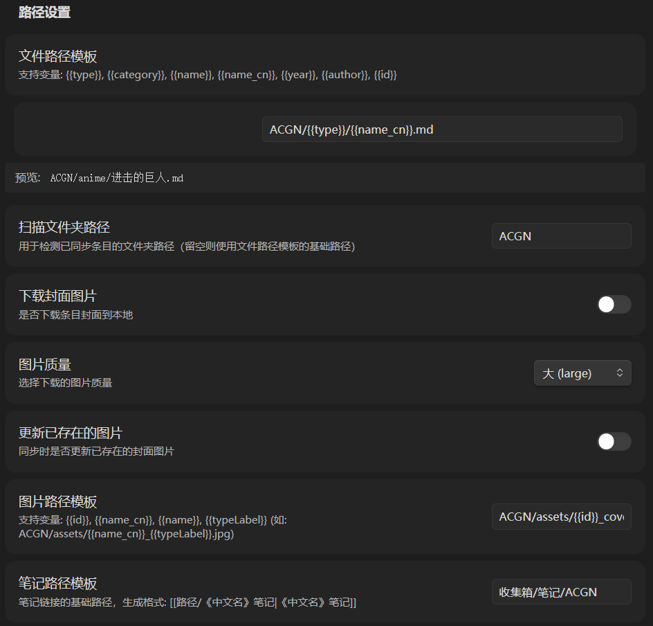
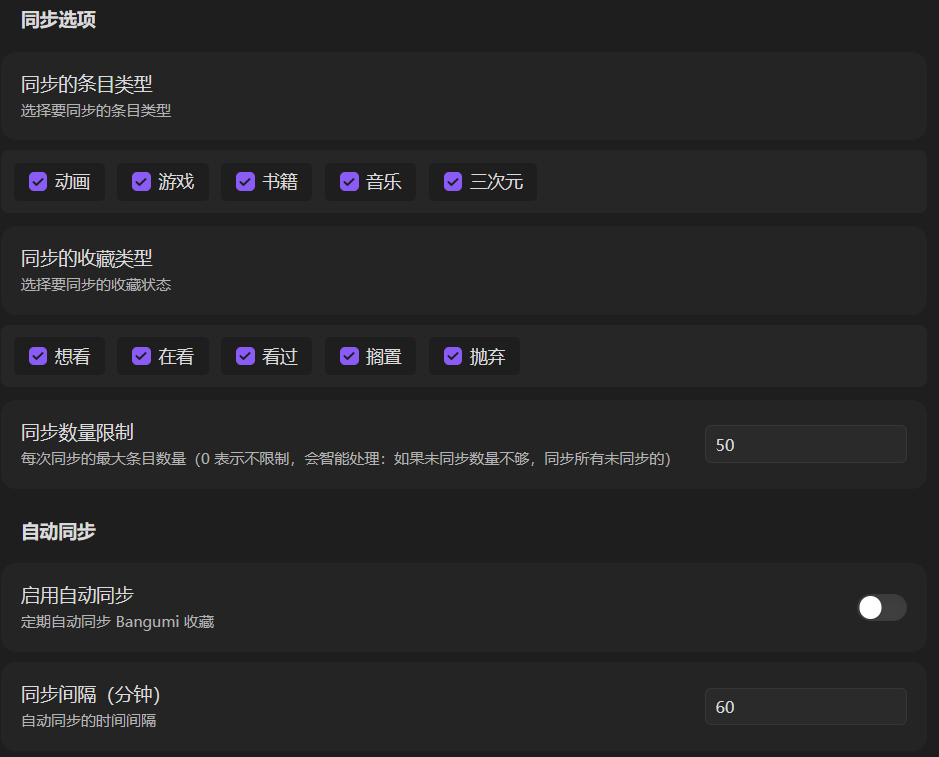
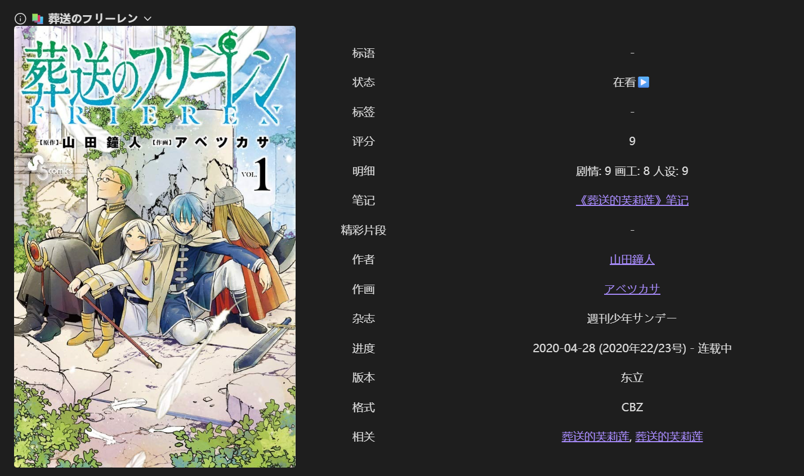
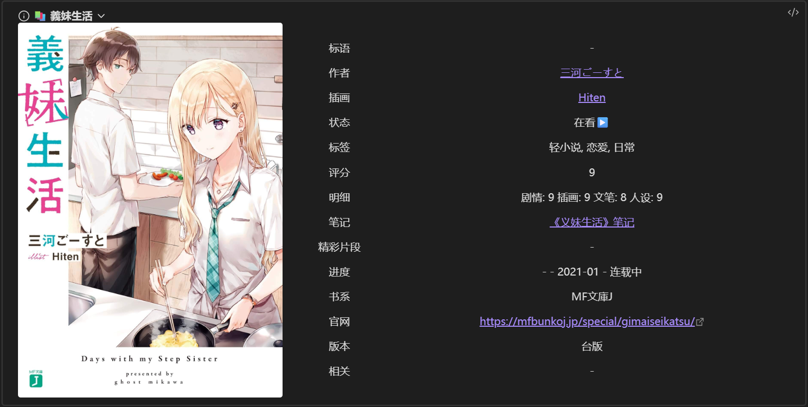

# Bangumi Sync

一个用于 Obsidian 的插件，可以将你在 Bangumi（番组计划）上的收藏同步到 Obsidian 笔记中。


## 核心功能

### 🔄 同步 Bangumi 用户个人数据

同步你在 Bangumi 上的所有个人数据到本地笔记：

- **收藏信息**：评分、短评、标签、收藏状态
- **观看进度**：动画集数、小说卷数、漫画话数
- **评分明细**：音乐、剧情、人设、美术等多维度评分
- **多类型支持**：动画、游戏、小说、漫画、画集、音乐、三次元

### 📝 自定义模板

为每种条目类型配置不同的笔记模板：

- **灵活变量**：支持 `{{name}}`、`{{rating}}`、`{{my_rate}}` 等数十种变量
- **条件渲染**：`{{#if my_rate}}评分: {{my_rate}}{{/if}}`
- **默认值**：`{{director|未知}}`
- **模板来源**：标准模板 / 作者自用模板 / 从文件选择 / 自定义内容



📖 详细模板设计文档：[docs/TEMPLATE_GUIDE.md](docs/TEMPLATE_GUIDE.md)

### 🖼️ 正文表格展示

生成的笔记包含美观的信息表格，配合 Dataview 插件实现动态显示：



- **封面图片**：可选下载到本地，支持多种质量
- **角色信息**：最多 9 个角色及其声优、头像
- **集数追踪**：紧凑数字框显示，悬浮显示标题和日期

### ↔️ 双向同步

本地修改可以同步回 Bangumi 云端：

- **短评双向同步**：对比本地与云端差异，选择保留哪个版本
- **标签双向同步**：支持合并本地与云端标签
- **冲突检测**：自动检测数据冲突，提供解决选项

## 辅助功能

### 同步管理

- **增量同步**：自动检测已同步条目，避免重复导入
- **同步预览**：导入前预览条目列表，勾选要导入的条目
- **自动同步**：支持定时自动同步
- **智能数量限制**：未同步数量不足时自动同步全部

### 控制面板

- **收藏管理**：查看所有收藏条目，按类型/状态筛选
- **同步状态标记**：显示每个条目是否已同步
- **批量操作**：同步选中、强制同步、删除本地文件
- **批量编辑**：修改已同步条目的 frontmatter 属性，支持撤销

### 其他

- **快捷键支持**：默认快捷键，控制面板键盘导航
- **数据缓存**：控制面板数据缓存 10 分钟
- **默认属性值**：批量同步时自动填充预设值

## 最新更新 (v4.3.4)

### 代码质量修复
- 修复 while(true) 常量条件，重构分页循环
- 移除 confirm() 调用，使用自定义确认弹窗
- 清理未使用的导入，优化代码结构
- 移除内联样式，改用 CSS 类
- 评分明细拆分为独立属性（音乐评分、人设评分等）

### 模板优化
- 动画模板正文表格"制作"改为"精彩片段"
- 小说、漫画模板新增"精彩片段"属性
- 模板设置新增"复制当前模板"按钮

## 推荐插件

本插件的模板使用了 `\`= this.属性\`` 语法在表格中显示属性值，需要安装以下插件：

### Dataview（必需）

[Dataview](https://blacksmithgu.github.io/obsidian-dataview/) 是一个强大的数据查询插件，本插件使用其内联查询功能。

**安装方法**：
1. 在 Obsidian 设置中进入"社区插件"
2. 搜索 "Dataview" 并安装
3. 启用 Dataview 插件

**作用**：
- 模板表格中的 `\`= this.评分\`` 会显示当前笔记的"评分"属性
- `\`= this.观看状态\`` 会显示"观看状态"属性

如果不安装 Dataview，表格中会显示原始的 `\`= this.属性\`` 文本，而非属性值。

## 安装

### 从社区插件市场安装（推荐）

1. 在 Obsidian 设置中进入"社区插件"
2. 搜索 "Bangumi Sync" 并安装

### 从 GitHub Release 安装

1. 访问 [Releases](https://github.com/threeyang3/bangumi-sync/releases) 页面
2. 下载最新版本的 `main.js`、`manifest.json` 和 `styles.css`
3. 复制到 `你的Vault/.obsidian/plugins/bangumi-sync/` 目录

### 手动构建

```bash
git clone https://github.com/threeyang3/bangumi-sync.git
cd bangumi-sync
npm install
npm run build
```

## 配置

### 获取 Access Token

1. 访问 [Bangumi Access Token 生成页面](https://next.bgm.tv/demo/access-token)
2. 点击生成 Token
3. 在 Obsidian 设置中找到 "Bangumi Sync"，粘贴 Token

### 基本设置



| 设置项 | 说明 |
|--------|------|
| Access Token | Bangumi API 访问令牌 |
| 文件路径模板 | 笔记保存路径，支持变量 |
| 图片路径模板 | 封面图片保存路径 |
| 图片质量 | 下载图片的质量（小/中/大） |
| 下载封面图片 | 是否下载条目封面到本地 |

## 使用方法

### 快捷键

| 功能 | 快捷键 |
|------|--------|
| 打开控制面板 | `Ctrl+Shift+B` |
| 同步收藏 | `Ctrl+Shift+S` |
| 快速同步 | `Ctrl+Shift+Q` |

### 手动同步



1. 使用命令 "同步 Bangumi 收藏"
2. 选择条目类型、收藏状态、同步数量
3. 预览弹窗中勾选条目、填写评分明细
4. 选择导入方式：全部导入 / 只导入选中的

### 控制面板

1. 点击左侧 Ribbon 图标或使用快捷键 `Ctrl+Shift+B`
2. 查看所有收藏条目，按类型/状态筛选
3. 同步选中的未同步条目，或批量编辑已同步条目

## 模板示例

### 漫画类型模板



### 轻小说类型模板



## 模板变量

### 路径变量

| 变量 | 说明 | 示例 |
|------|------|------|
| `{{type}}` | 条目类型 | anime |
| `{{name_cn}}` | 中文名 | 进击的巨人 |
| `{{year}}` | 年份 | 2013 |
| `{{id}}` | 条目 ID | 10060 |

### 内容变量

#### 用户个人数据
- `{{my_rate}}` - 我的评分
- `{{my_comment}}` - 我的短评
- `{{my_status}}` - 收藏状态
- `{{my_tags}}` - 我的标签

#### 条目信息
- `{{name}}` / `{{name_cn}}` - 原名 / 中文名
- `{{rating}}` / `{{rank}}` - Bangumi 评分 / 排名
- `{{summary}}` - 简介
- `{{tags}}` - 用户标签

#### 评分明细
| 类型 | 评分字段 |
|------|----------|
| 动画 | 音乐、人设、剧情、美术 |
| 小说 | 剧情、插画、文笔、人设 |
| 漫画 | 剧情、画工、人设 |
| 游戏 | 剧情、趣味、音乐、美术 |

### 模板高级语法

```markdown
{{#if my_rate}}评分: {{my_rate}}{{/if}}
rating: {{rating|未评分}}
```

详细模板变量说明请参考 `docs/TEMPLATE_GUIDE.md`。

## 常见问题

### Q: 为什么扫描不到已同步的条目？

确保模板中包含 `id: {{id}}` 字段。插件通过 frontmatter 中的 `id` 字段识别已同步条目。

### Q: 如何自定义模板？

在设置面板中为每种条目类型选择：默认模板 / 从文件选择 / 自定义内容。

### Q: 图片下载失败怎么办？

检查图片路径模板是否正确，确保目标目录存在。

## 相关链接

- [Bangumi API 文档](https://bangumi.github.io/api/)
- [获取 Access Token](https://next.bgm.tv/demo/access-token)

## 支持开发

如果这个插件对你有帮助，欢迎赞助支持开发者：


## 许可证

MIT License